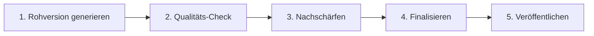

# **Praxisleitfaden: Content-Erstellung mit Prompts für Mitglieder-Kommunikation**

---

## **Glossar wichtiger Begriffe**

- **Hook:** Aufmerksamkeitsstarker Einstieg, der Leser sofort fesselt
- **CTA (Call-to-Action):** Handlungsaufforderung am Ende eines Textes
- **USP (Unique Selling Proposition):** Alleinstellungsmerkmal
- **SEO:** Suchmaschinenoptimierung für bessere Auffindbarkeit
- **Prompt:** Strukturierte Anweisung an ein KI-Modell
- **Iteration:** Schrittweise Verbesserung durch wiederholte Durchgänge
- **Content-Module:** Wiederverwendbare Textbausteine

---

## 1. Grundlagen der Content-Generierung

**Warum strukturierte Prompts entscheidend sind:**

* Konsistente Qualität
* Wiedererkennbarer Stil & Ton
* Nutztauglicher Content statt Rohtexte
* Klare Markenausrichtung
* Vereinfachte Überarbeitung

**Praxisregel:** Denke bei jedem Prompt wie ein Redakteur – mit **Zielgruppe, Struktur und gewünschtem Effekt** im Kopf.

> 📊 **Visualisierung empfohlen:** Erstellen Sie ein Mindmap mit Ihrer Zielgruppe im Zentrum und den verschiedenen Content-Formaten als Äste

---

## 2. Content-Struktur kontrollieren

**Schwacher Prompt:**
> „Schreibe einen Artikel über Volksbank-Mitgliedschaft."

➡ Ergebnis: Unklare Länge, zufälliger Stil, fehlender Nutzen.

**Starker Prompt mit Struktur:**
> „Erstelle einen Blogartikel über Volksbank-Mitgliedschaft mit folgenden Anforderungen:
> 
> * Titel: SEO-optimiert, z. B. ‚5 Gründe für eine Volksbank-Mitgliedschaft'
> * Einleitung (100 Wörter): Hook, Kontext, Vorschau
> * Hauptteil: 3–4 Vorteile, je 200 Wörter, mit Beispielen (z. B. 3 % Dividende), Tipps für Interessenten
> * Fazit (100 Wörter): Zusammenfassung + Call-to-Action
> * Stil: professionell, nahbar, aktiv, mit Zwischenüberschriften und Beispielen"

➡ Ergebnis: Klarer Aufbau, relevanter Content, sofort nutzbar.

---

## 3. Stil-Frameworks für verschiedene Content-Typen

| Content-Typ | Struktur-Elemente | Stil-Guidelines |
|------------|------------------|-----------------|
| **Business-Schreiben** | Management Summary – Analyse – Maßnahmen | Professionell, prägnant, datengestützt |
| **Technische Dokumentation** | Überblick – Schritt-für-Schritt – Referenz | Technisch präzise, klare Terminologie |
| **Blogpost** | Hook – Problem – Lösung – Beispiele – Fazit | Nahbar, aktiv, Storytelling |
| **E-Mail** | Begrüßung – Hauptnachricht – Call-to-Action | Freundlich-professionell, kurz & klar |

➡ **Wirkung:** Einheitliche Standards, einfaches Wiederverwenden.

---

## 4. Ton- und Stimmen-Kontrolle

**Definiere vorab:**
* **Ton:** Professionell, kompetent, aber nahbar.
* **Begriffe nutzen/vermeiden:**
  * ✅ Mitglied, Dividende, Mitbestimmung
  * ❌ Kunde, Aktie
* **Engagement-Elemente:**
  * Leser direkt ansprechen
  * Rhetorische Fragen nutzen
  * Relevante Beispiele geben

**Vorher/Nachher-Beispiel:**
* ❌ „Sie müssen Anteile zeichnen."
* ✅ „Als Mitglied profitieren Sie von Anteilen, die Ihnen Mitbestimmung und Dividende sichern."

---

## 5. Qualitätskontroll-Framework

**Checkliste im Prompt mitgeben:**
* Fachliche Genauigkeit (Beispiele echter VR-Banken)
* Fachbegriffe erklären
* Praktische Tipps integrieren
* Klare Handlungspunkte am Ende

**Praxis-Prompt:**
> „Erstelle einen Fachartikel (800 Wörter) über die digitale Mitglieder-App.
> 
> * Zielgruppe: Vorstand & Geschäftsführung
> * Qualitätsanforderungen: Fachliche Genauigkeit, alle Fachbegriffe erklären, Best Practices nennen, Fehlerquellen zeigen, Handlungsempfehlungen geben."

➡ Ergebnis: KI liefert Text, der Standards erfüllt – leichter überprüfbar.

---

## 6. Iterativer Workflow (statt One-Shot)

**Schritt-für-Schritt-Vorgehen:**



1. Rohversion mit Prompt generieren
2. Qualitäts-Check durchführen (Struktur, Ton, Wert)
3. Nachschärfen (z. B. mehr Beispiele einbauen)
4. Finalisieren (Formatierung, SEO, CTA)

➡ Wirkung: Mehr Kontrolle, bessere Endergebnisse.

---

## 7. Multi-Format-Content

**Schritt 1: Kernbotschaft erstellen**
> „Erstelle eine Ankündigung zur Mitglieder-werben-Mitglieder-Kampagne:
> Vorteil: 50 € für beide
> USP: Stärkung der Gemeinschaft
> Zielgruppe: aktive Mitglieder"

**Schritt 2: Plattform-spezifisch anpassen**
* **LinkedIn:** 200 Wörter, professioneller Ton
* **Instagram:** 4 Slides, visuell, CTA
* **Newsletter:** E-Mail-Vorlage, Call-to-Action mit Link

➡ Wirkung: Konsistenz + kanalgenaue Optimierung.

---

## 8. Progressive Offenlegung

**Praxis-Beispiel Mitglieder-Inhalte:**
1. **Grundlage:** „Was ist eine Genossenschaft?" (1 Mitglied = 1 Stimme)
2. **Mittlere Ebene:** Technische Aspekte (Geschäftsanteile, Dividende)
3. **Fortgeschritten:** Steuervorteile, Fusionen, Kapitalerhöhungen

➡ Wirkung: Mitglieder werden Schritt für Schritt abgeholt, Überforderung vermieden.

---

## 9. Modularer Content

**Vorgefertigte Textbausteine (Module):**
* Begrüßung (Neu-/Bestandsmitglieder, Jubiläen)
* Info (Dividenden, digitale Services, Generalversammlung)
* Abschluss (Dank, CTA, Kontaktinfos)

**Beispiel: Dividenden-Mitteilung**
1. Begrüßung für Bestandsmitglieder
2. Ankündigung Dividende
3. Hinweis auf Anteilserhöhung
4. Kontakt Mitgliederbetreuung
5. Dankesnachricht

➡ Ergebnis: Einheitliche, schnelle und personalisierte Kommunikation.

---

## 10. Story-getriebener Content

**Beispiel-Erzählbogen:**
* Herausforderung: Familie sucht faire Bank
* Lösung: Volksbank-Mitgliedschaft entdeckt
* Erfolg: Hausfinanzierung mit Mitgliederkonditionen

➡ Wirkung: Inhalte werden emotionaler, einprägsamer und relevanter.

---

## 11. Mikro-Lern-Formate

**Beispiel: Dividende erklären**
* **Schnellkonzept:** „Eine Dividende ist Ihr jährlicher Anteil am Geschäftserfolg."
* **Praxisübung:** „Berechnen Sie: 500 € Anteil → 3 % Dividende = 15 €/Jahr."
* **Review:** Zusammenfassung + CTA „Jetzt Anteile erhöhen."

➡ Wirkung: Komplexe Themen leicht verständlich & interaktiv vermittelt.

---

## 12. Troubleshooting – Häufige Probleme lösen

### **Problem 1: KI generiert zu allgemeine Inhalte**
**Lösung:** Spezifische Details, Zahlen und Beispiele im Prompt nennen
```
Statt: "Schreibe über Mitgliedervorteile"
Besser: "Schreibe über 3 konkrete Mitgliedervorteile: 3% Dividende, Stimmrecht bei Generalversammlung, exklusive Beratungstermine"
```

### **Problem 2: Falscher Ton getroffen**
**Lösung:** Tone-of-Voice-Beispiele mitgeben
```
"Schreibe im Stil dieser Beispielsätze:
- 'Gemeinsam gestalten wir Ihre finanzielle Zukunft'
- 'Als Mitglied sind Sie Teil unserer Erfolgsgeschichte'"
```

### **Problem 3: KI wiederholt sich**
**Lösung:** Varianten explizit anfordern
```
"Erstelle 3 unterschiedliche Versionen der Einleitung, jeweils mit anderem Schwerpunkt:
Version A: Emotionaler Einstieg
Version B: Zahlen/Fakten-basiert
Version C: Mit Mitglieder-Zitat"
```

### **Problem 4: Unvollständige Antworten**
**Lösung:** Minimale Anforderungen definieren
```
"Der Text muss mindestens enthalten:
- 5 konkrete Vorteile mit je 2-3 Sätzen
- 3 Praxisbeispiele
- 1 klare Handlungsaufforderung"
```

### **Problem 5: Inkonsistente Formatierung**
**Lösung:** Format-Template vorgeben
```
"Formatiere wie folgt:
# Hauptüberschrift
## Unterüberschrift
- Aufzählungspunkt
**Fettgedruckt** für Hervorhebungen"
```

---

## 13. Prompt-Bibliothek – Kopierfertige Vorlagen

### **📧 E-Mail-Vorlage: Mitglieder-Newsletter**
```
Erstelle einen Mitglieder-Newsletter mit:
- Betreff: [Thema] + Mehrwert-Versprechen
- Anrede: Persönlich "Liebe/r [Name]"
- Einleitung: Aktueller Bezug (30 Wörter)
- Hauptteil: 3 News-Blöcke à 100 Wörter
- Abschluss: CTA + Kontaktdaten
- Ton: Freundlich-professionell, "Sie"-Anrede
- Keywords: Mitglied, Dividende, regional, gemeinsam
```

### **📝 Blogpost-Vorlage: Mitgliedervorteile**
```
Verfasse einen Blogpost (600 Wörter) über [Thema]:
- Titel: Zahl + Nutzen + Zielgruppe
- Meta-Description: 155 Zeichen mit Keyword
- Einleitung: Problem/Frage aufwerfen (80 Wörter)
- Hauptteil: 4 Unterkapitel mit je 1 Vorteil
- Beispiele: Pro Vorteil 1 konkretes Szenario
- Fazit: Zusammenfassung + nächster Schritt
- SEO: Keyword 5x natürlich einbauen
```

### **📊 Präsentations-Vorlage: Jahresbericht**
```
Erstelle Präsentationsfolien für Generalversammlung:
- Folie 1: Titel + Jahresangabe
- Folie 2-4: Geschäftszahlen (Bulletpoints, max. 5 pro Folie)
- Folie 5-7: Mitgliederentwicklung (Diagramm-Beschreibungen)
- Folie 8: Dividendenvorschlag (Hervorhebung)
- Folie 9: Ausblick nächstes Jahr (3 Hauptziele)
- Folie 10: Danke + Kontakt
- Stil: Professionell, zahlenbasiert, positiv
```

### **💬 Social Media-Vorlage: Mitglieder werben**
```
Erstelle Social Media Posts für Kampagne:
Facebook/LinkedIn (150 Wörter):
- Hook: Frage oder Statistik
- Hauptteil: 3 Vorteile mit Emojis
- CTA: Link + Handlungsaufforderung
Instagram (50 Wörter):
- 5 prägnante Bulletpoints
- 5 relevante Hashtags
- Story-Idee mit Swipe-Up
```

---

## 14. Ethik & Verantwortung im KI-Content

### **Grundprinzipien:**

**1. Transparenz**
- KI-generierte Inhalte bei Bedarf kennzeichnen
- Keine falschen Autorenschaften vortäuschen

**2. Faktentreue**
- Alle Zahlen und Fakten manuell überprüfen
- Aktualität von Informationen sicherstellen
- Bei Unsicherheit: Quelle angeben lassen

**3. Bias-Vermeidung**
- Diverse Perspektiven einfordern
- Geschlechtergerechte Sprache nutzen
- Regionale Besonderheiten berücksichtigen

**4. Datenschutz**
- Keine echten Mitgliederdaten in Prompts
- Anonymisierte Beispiele verwenden
- Vertrauliche Infos außen vor lassen

**5. Rechtliche Aspekte**
- Urheberrechte beachten
- Disclaimer bei Finanzthemen
- Compliance-Vorgaben einhalten

### **Praktische Umsetzung:**
```
Prompt-Zusatz für ethische Standards:
"Beachte: Geschlechtsneutrale Formulierung, 
keine Heilsversprechen, Disclaimer bei 
Finanzthemen, faktische Korrektheit prioritär"
```

---

## 15. KI-Modelle im Vergleich

| Modell | Stärken | Schwächen | Ideal für |
|--------|---------|-----------|-----------|
| **ChatGPT** | Kreativität, Vielseitigkeit | Aktualität, manchmal zu ausschweifend | Blogposts, kreative Texte |
| **Claude** | Präzision, Struktur, lange Texte | Weniger kreativ | Fachliche Dokumentation |
| **Gemini** | Google-Integration, Aktualität | Noch in Entwicklung | Research, aktuelle Themen |
| **Copilot** | Microsoft-Integration | Begrenzte Anpassung | Office-Dokumente |
| **Perplexity** | Quellenangaben, Research | Weniger kreativ | Fakten-Check, Recherche |

**Empfehlung für Genossenschafts-Content:**
- **Haupttool:** Claude (für strukturierte Fachtexte)
- **Ergänzung:** ChatGPT (für kreative Kampagnen)
- **Research:** Perplexity (für Marktdaten)

---

## 16. Praxisübungen mit Lösungsansätzen

### **Übung 1: Einladung Generalversammlung** 🟢
**Aufgabe:** Prompt für formelle Einladung erstellen

**Lösungsansatz:**
```
"Erstelle eine formelle Einladung zur Generalversammlung:
- Datum/Ort/Zeit: [einsetzen]
- Tagesordnung: 5 Punkte
- Rechtliche Hinweise
- Anmeldefrist
- Ton: Formell aber einladend
- Länge: 300 Wörter"
```

### **Übung 2: Iterative Verbesserung** 🟡
**Aufgabe:** Newsletter in 3 Iterationen optimieren

**Ablauf:**
1. Basis-Newsletter generieren
2. Iteration 1: "Füge 3 konkrete Mitglieder-Testimonials hinzu"
3. Iteration 2: "Erhöhe Dringlichkeit mit Deadline"
4. Iteration 3: "Optimiere Betreffzeile für höhere Öffnungsrate"

### **Übung 3: Multi-Channel-Kampagne** 🔴
**Aufgabe:** Eine Botschaft in 5 Formate übersetzen

**Kernbotschaft:** "Junge Mitglieder erhalten Startbonus"
- E-Mail (formal)
- WhatsApp (casual)
- Instagram (visuell)
- Pressemitteilung (offiziell)
- Interne Kommunikation (informativ)

---


## **Abschluss-Checkliste für jeden Prompt:**

✅ **Vor dem Prompt:**
- [ ] Zielgruppe definiert?
- [ ] Gewünschtes Format klar?
- [ ] Tonalität festgelegt?

✅ **Im Prompt:**
- [ ] Struktur vorgegeben?
- [ ] Länge spezifiziert?
- [ ] Beispiele genannt?

✅ **Nach der Generierung:**
- [ ] Fakten geprüft?
- [ ] Ton passend?
- [ ] CTA vorhanden?
- [ ] Rechtlich unbedenklich?

---

